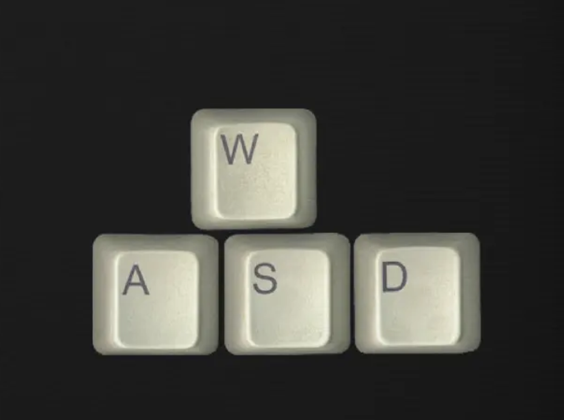
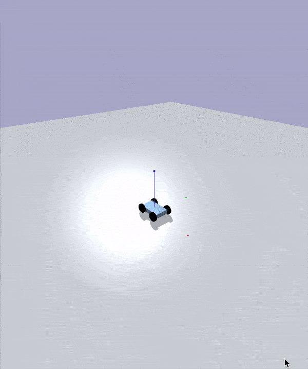

# PyBullet Race Car

___

In this project I created a simple environment for a keyboard controlled race car. 
You can control the race car using the 'a', 'd', 'w', and 's' keys. 

Where 'w' is to move forward, 's' is to move back/decrease speed. 
'a' is used to turn right, and 'd' is used to turn right. 

Will update soon, and make it a pid controlled car. 

### Demo:

___

